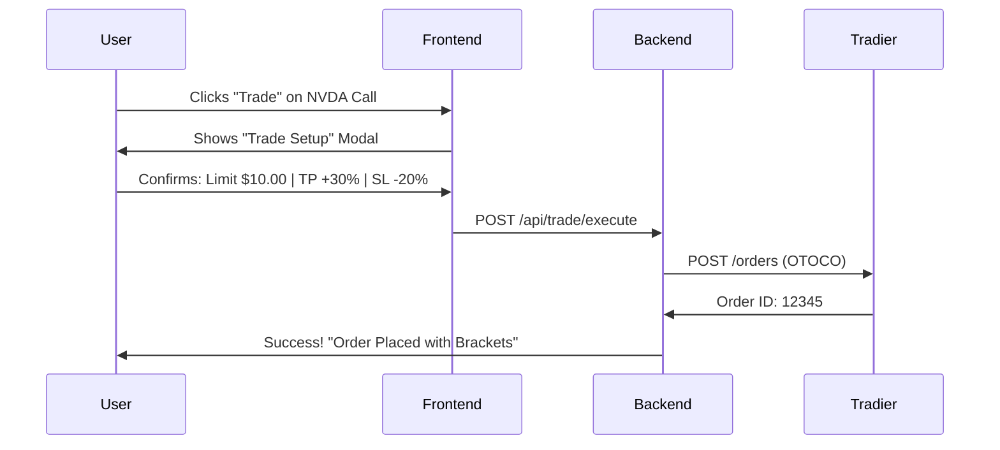

# Automated Trading Analysis — "One-Click Execution"

> **Status**: Planning / Research
> **Objective**: Allow users to click "Trade" on a scan result to place an entry order with attached Stop Loss and Take Profit (Bracket Order) on Tradier.

---

## 1. The Strategy: OTOCO (One-Triggers-OCO)

To achieve "Enter + Set SL + Set TP" in one go, we need an **OTOCO** (One Triggers One-Cancels-Other) order structure.

- **Leg 1 (Primary)**: Buy to Open (e.g. NVDA Call).
- **Leg 2 (Triggered)**: A "One-Cancels-Other" group options:
    - **Leg 2a**: Sell to Close at Profit Target (Limit Order).
    - **Leg 2b**: Sell to Close at Stop Loss (Stop Order).

If Leg 1 fills, Legs 2a and 2b become active. If 2a fills, 2b is cancelled (and vice versa).

## 2. Tradier API Implementation (Conceptual)

**Endpoint**: `POST /v1/accounts/orders`

**Payload Structure:**
```json
{
  "class": "oto",  // One-Triggers-Other
  "duration": "day",
  "symbol": "NVDA",
  "option_symbol": "NVDA260717C00200000",
  "side": "buy_to_open",
  "quantity": "1",
  "type": "market", // or limit
  
  // The Triggered Orders (Bracket)
  "oto[0][duration]": "gtc",
  "oto[0][side]": "sell_to_close",
  "oto[0][quantity]": "1",
  "oto[0][type]": "limit",
  "oto[0][price]": "13.00",  // Take Profit Price (e.g. +30%)
  
  "oto[1][duration]": "gtc",
  "oto[1][side]": "sell_to_close",
  "oto[1][quantity]": "1",
  "oto[1][type]": "stop",
  "oto[1][stop_price]": "8.00" // Stop Loss Price (e.g. -20%)
}
```

> **Note**: Tradier documentation sometimes refers to this as linking orders via `otoc` or bracket parameters. We will verify the exact "Advanced Order" syntax during implementation.

## 3. Recommended Workflow



## 4. UI "Pro Trader" Features

1.  **Risk Slider**: A slider to set SL/TP percentages (e.g. Risk 20% / Reward 50%).
2.  **Smart Pricing**: Default the entry price to the "Mid" price, not the "Ask".
3.  **Order Preview**: Show exactly what will happen:
    *   "Buying 1 Contract at ~$1,000"
    *   "Max Loss: $200 (Stop at $800)"
    *   "Target Profit: $500 (Limit at $1,500)"

## 5. Technical Requirements

- [ ] **Tradier Token**: Need a sophisticated `TRADIER_ACCESS_TOKEN` with trading permissions (currently using a read-only or sandbox key?).
- [ ] **Backend Endpoint**: Create `POST /api/trade/execute` in `app.py`.
- [ ] **Order Service**: Create `backend/services/execution_service.py` to handle the complex JSON construction.
- [ ] **Account Selection**: If the user has multiple accounts, they need to select one.

## 6. Next Steps

1.  **Verify Access**: Check if current Tradier token allows trading (or is read-only).
2.  **Sandbox Test**: Attempt to place a complex OTO order in the Tradier Sandbox.
3.  **Backend Logic**: Write the `ExecutionService`.
4.  **Frontend Modal**: Build the "Trade Setup" popup.
