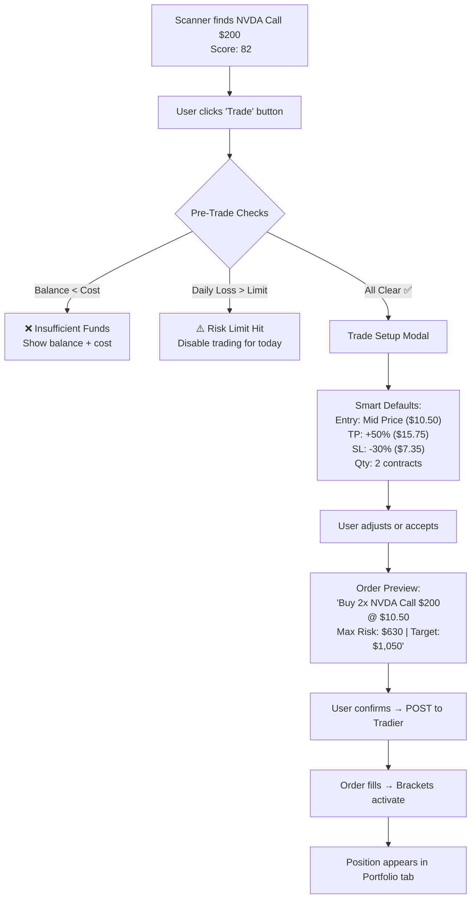
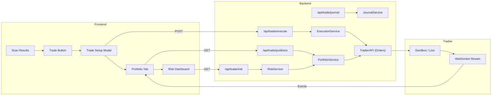

# Automated Trading Analysis — "One-Click Execution"

> **Status**: Planning / Research
> **Objective**: Turn scan results into real trades with a single click, including risk management (Stop Loss + Take Profit), portfolio tracking, and trade journaling.

---

## 1. The Core Strategy: OTOCO Bracket Orders

To achieve "Enter + Set SL + Set TP" in one atomic operation:

- **Leg 1 (Primary)**: Buy to Open (e.g. NVDA $200 Call)
- **Leg 2 (Triggered on Fill)**: OCO Group:
    - **Leg 2a**: Sell to Close at Profit Target (Limit Order)
    - **Leg 2b**: Sell to Close at Stop Loss (Stop Order)

If Leg 1 fills → Legs 2a + 2b activate. If 2a fills → 2b is auto-cancelled (and vice versa).

---

## 2. Tradier API Capabilities (Confirmed)

| Capability | Endpoint | Use Case |
|-----------|----------|----------|
| **Account Balance** | `GET /v1/accounts/{id}/balances` | Pre-trade buying power check |
| **Positions** | `GET /v1/accounts/{id}/positions` | Portfolio dashboard, P&L tracking |
| **Place Order** | `POST /v1/accounts/{id}/orders` | Entry + Bracket orders |
| **Order History** | `GET /v1/accounts/{id}/orders` | Trade journal auto-population |
| **Modify Order** | `PUT /v1/accounts/{id}/orders/{order_id}` | Adjust SL/TP after entry |
| **Cancel Order** | `DELETE /v1/accounts/{id}/orders/{order_id}` | Emergency exit |
| **Streaming** | `wss://ws.tradier.com/v1/` | Real-time fill notifications |
| **Sandbox** | `sandbox.tradier.com/v1/` | Paper trading mode |

---

## 3. The Full User Journey



---

## 4. Pre-Trade Intelligence (Before the Click)

### 4A. Smart Position Sizing
Instead of asking "how many contracts?", we calculate it:

```
Risk Per Trade = Account Balance × Risk % (default 2%)
Max Loss Per Contract = Entry Price × SL % × 100
Suggested Quantity = floor(Risk Per Trade / Max Loss Per Contract)
```

**Example:**
- Account Balance: $25,000
- Risk Per Trade (2%): $500
- Entry Price: $10.50, SL: -30% → Max Loss = $315/contract
- **Suggested Quantity: 1 contract** (within $500 risk budget)

### 4B. Smart SL/TP Defaults from Scanner Data
Don't use arbitrary percentages. Use the data we already have:

| Data Point | SL Default | TP Default |
|-----------|-----------|-----------|
| **ATR** (Average True Range) | Entry - 1.5× ATR | Entry + 2× ATR |
| **Support/Resistance** | Below nearest support | Above nearest resistance |
| **Gamma Wall** | Below put wall | Above call wall |
| **Strategy** | Weekly: -25% / LEAP: -15% | Weekly: +50% / LEAP: +100% |

> **Pro Tip**: For LEAPs, use wider stops (15-20%) because they have more time value decay noise. For weeklies, tighter stops (25-30%) because theta decay is brutal.

### 4C. Pre-Trade Checklist (Auto-Validated)
Before the order goes out, the system validates:

- [ ] Buying power sufficient?
- [ ] Bid-Ask spread < 10%? (Wide spreads = bad fills)
- [ ] Open Interest > 100? (Liquidity check)
- [ ] No earnings within 3 days? (Unless user acknowledges)
- [ ] Daily loss limit not exceeded?
- [ ] Position not already open for this ticker?

---

## 5. Post-Trade: Portfolio Dashboard

### 5A. Live Positions Panel
A new "Portfolio" tab showing all open positions:

| Ticker | Type | Strike | Entry | Current | P&L | P&L % | SL | TP | Status |
|--------|------|--------|-------|---------|-----|-------|----|----|--------|
| NVDA | Call | $200 | $10.50 | $12.30 | +$180 | +17% | $7.35 | $15.75 | 🟢 Watching |
| AAPL | Call | $250 | $5.20 | $4.80 | -$40 | -8% | $3.64 | $7.80 | 🟡 Dipping |

### 5B. One-Click Actions from Portfolio
- **"Close Now"** → Market order to sell immediately
- **"Adjust SL"** → Modify the stop order (e.g., trail it up)
- **"Adjust TP"** → Modify the limit order
- **"Add to Position"** → Buy more contracts (scale in)

---

## 6. Trade Journal (Auto-Generated)

Every trade automatically logs:

```json
{
  "ticker": "NVDA",
  "strategy": "Weekly Call",
  "entry_date": "2026-02-17",
  "entry_price": 10.50,
  "exit_date": null,
  "exit_price": null,
  "conviction_score": 82,
  "base_score": 75,
  "ai_thesis": "Bullish MA + surging volume + positive earnings...",
  "stop_loss": 7.35,
  "take_profit": 15.75,
  "outcome": "OPEN",
  "notes": ""
}
```

**Why this matters:**
- See which conviction score ranges actually win (e.g., "Trades with score >80 win 68% of the time")
- Identify which strategies work best for you
- Tax reporting at year-end

---

## 7. Safety Guardrails

### 7A. Paper Trading Mode (Sandbox First)
- Toggle between **Live** and **Paper** mode in settings
- Paper mode uses Tradier Sandbox (`sandbox.tradier.com`)
- All features work identically, but no real money moves
- **Recommendation**: Run in paper mode for 2 weeks before going live

### 7B. Daily Loss Circuit Breaker
```
If total realized losses today > $X (configurable):
    → Disable "Trade" button for the rest of the day
    → Show: "Daily loss limit reached. Take a break."
```

### 7C. Confirmation Dialog
Every trade shows a **bold, red-text confirmation**:
> ⚠️ **YOU ARE ABOUT TO SPEND $1,050.00**
> Max Loss: $630.00 | Target Gain: $1,050.00
> [CONFIRM TRADE] [CANCEL]

### 7D. No Market Orders on Options
**Pro Recommendation**: Always default to **Limit Orders** on options. Market orders on illiquid options can fill at terrible prices. We should:
- Default to "Limit at Mid"
- If bid-ask spread > 15%, show a warning: "Wide spread detected. Consider adjusting your limit."

---

## 8. Advanced Features (Phase 2)

### 8A. Trailing Stop
Instead of a fixed stop, the stop moves up as the price rises:
- "Trail by 20%" → If option goes from $10 → $15, stop moves from $7 → $12

### 8B. Partial Exits
- "Sell 50% at +30%, let the rest ride to +100%"
- This converts one bracket into two:
  - Leg 2a: Sell 1 contract at $13.00
  - Leg 2b: Sell 1 contract at $20.00 (or trail)

### 8C. Time-Based Exit
- "If no movement after 5 days, close position"
- Useful for weeklies where theta decay accelerates into expiry

### 8D. Real-Time Alerts (Streaming)
- Tradier WebSocket streaming for account events
- Push notifications when:
  - Order fills
  - Stop Loss triggered
  - Take Profit hit
  - Position approaching breakeven

---

## 9. Trade Placement Efficiency — Making It Frictionless

The goal: **3 clicks from scan result to live order.** Click "Trade" → Review defaults → Confirm.

### 9A. Speed Features

| Feature | How It Works | Why It Matters |
|---------|-------------|----------------|
| **Auto-Populated Modal** | Ticker, strike, expiry, mid-price, SL, TP all pre-filled from scan data | Zero manual entry |
| **Quick-Adjust Buttons** | `[-$0.05]` `[+$0.05]` next to price fields | Fine-tune without typing |
| **Keyboard Shortcuts** | `Enter` = Confirm, `Esc` = Cancel, `Tab` = Next field | Pro traders hate mice |
| **Repeat Last Trade** | "Same setup, different ticker" button | Batch scanning workflow |
| **Pre-Market Queue** | Place orders before market open; they fire at 9:30 AM | Capture the opening move |
| **Bid/Ask Live Refresh** | Prices update every 2 seconds in the modal | No stale quotes |

### 9B. Smart Fill Strategy

Options are illiquid compared to stocks. A "smart fill" engine should:

```
1. Check Bid-Ask Spread
   - If spread ≤ 5% of mid  → Limit at Mid (aggressive)
   - If spread 5-15%        → Limit at Mid + $0.05 (slightly above mid)
   - If spread > 15%        → ⚠️ WARNING: "Wide spread. Consider waiting."

2. If not filled in 30 seconds → Auto-adjust limit +$0.05 (up to 3 times)
3. If still not filled         → Notify user: "Order not filling. Adjust or cancel?"
```

> **Pro Tip**: Never market-order an option. The slippage on a $5 option with a $4.80/$5.20 spread can eat 4% of your position instantly.

### 9C. "Favorites" / Trade Templates

Save common setups:
- **"My Weekly Scalp"**: SL -25%, TP +50%, 1 contract, Limit at Mid
- **"My LEAP Value"**: SL -15%, TP +100%, auto-sized, Limit at Mid - $0.10
- **"Aggressive Momentum"**: SL -30%, TP +80%, 2 contracts, Limit at Ask

Templates load instantly when clicking "Trade" — one less decision to make.

### 9D. Bulk Trade Mode

After a scan returns 8 results, you might want to trade the top 3:
- Checkboxes on scan results → "Trade Selected (3)"
- Each gets a bracket order with your default template
- One confirmation screen for all 3 orders

---

## 10. Professional Risk Management Framework

> *"The goal of a professional trader is not to make money. It's to not lose money."*
> — Every hedge fund manager ever

### 10A. The 6 Iron Rules

| # | Rule | Our Implementation | Configurable? |
|---|------|--------------------|---------------|
| 1 | **1-2% Rule** | Never risk more than 2% of account on a single trade | Yes (`.env`) |
| 2 | **Portfolio Heat ≤ 6%** | Max total risk across ALL open positions = 6% of account | Yes |
| 3 | **Risk:Reward ≥ 1:2** | System rejects trades where TP < 2× SL distance | Yes (min ratio) |
| 4 | **Max Open Positions** | Limit to 5-8 concurrent positions | Yes |
| 5 | **Sector Concentration ≤ 25%** | No more than 25% of total risk in one sector | Yes |
| 6 | **Correlation Guard** | Warn if 3+ positions in same sector/same direction | Auto-detect |

### 10B. Position Sizing — The Math

The system auto-calculates the "right" number of contracts:

```
Account Balance         = $25,000
Risk Per Trade (2%)     = $500
Entry Price             = $10.50 per contract
Stop Loss               = -30% ($7.35)
Max Loss Per Contract   = ($10.50 - $7.35) × 100 = $315

Suggested Quantity      = floor($500 / $315) = 1 contract
Total Capital at Risk   = $315 (1.26% of account) ✅
```

If the calculation suggests 0 contracts → **Trade is too expensive for your risk budget**. The system blocks it:
> "⛔ This trade would risk $1,200 per contract (4.8% of account). Reduce position size or widen your stop."

### 10C. Portfolio Heat Monitor

"Portfolio Heat" = The total $ you'd lose if **every open position** hit its stop loss simultaneously.

```
Position 1: NVDA Call  → Max Loss = $315
Position 2: AAPL Call  → Max Loss = $280
Position 3: TSLA Put   → Max Loss = $410
                         ─────────────
Portfolio Heat          = $1,005 (4.02% of $25,000) ✅ Under 6%
```

**If a new trade would push heat above 6%:**
> "⚠️ Portfolio heat would reach 7.3%. Close an existing position or reduce size."

### 10D. The Tilt Protocol (Losing Streak Protection)

Professional traders reduce size after losses to prevent emotional "revenge trading":

| Consecutive Losses | Action |
|-------------------|--------|
| 1-2 losses | Normal — continue trading |
| 3 losses | ⚠️ Reduce position size by 50% |
| 5 losses | 🔴 Pause trading for 24 hours |
| 7 losses | ⛔ Force paper-trading mode until 3 consecutive wins |

> This is not punishment — it's math. A 3-loss streak means either the market regime changed or your edge isn't there today.

### 10E. IV Crush Protection

**The Problem:** Buying options before earnings → stock moves 2% → option drops 30% because IV collapses.

**Our Solution:**
```
Before placing any trade:
  1. Check if earnings are within 5 trading days
  2. If YES → Show warning:
     "⚠️ EARNINGS in 3 days. IV Crush risk is HIGH.
      Current IV: 85% (vs 30-day avg: 45%)
      Expected post-earnings IV: ~45%
      Estimated crush impact: -25% on premium"
  3. User must acknowledge: "I understand the IV risk" checkbox
```

### 10F. Time Decay (Theta) Management

Different strategies need different stop rules:

| Strategy | Theta Impact | SL Rule | Exit Rule |
|----------|-------------|---------|-----------|
| **Weekly (0-7 DTE)** | Brutal | Tight: -25% | Close by Thursday (avoid Friday theta) |
| **Swing (7-45 DTE)** | Moderate | Medium: -30% | Close if no movement in 5 days |
| **LEAP (150+ DTE)** | Minimal | Wide: -15% | Let it breathe; monthly review |

The system should auto-suggest the right SL width based on DTE:
```python
def suggest_stop_loss(dte):
    if dte <= 7:   return 0.25  # -25%
    elif dte <= 45: return 0.30  # -30%
    else:           return 0.15  # -15% (LEAP)
```

### 10G. The "Edge Score" — Only Trade When You Have an Edge

Not every scan result deserves your money. Add a minimum threshold:

| Conviction Score | Action |
|-----------------|--------|
| **80-100** | ✅ "High Edge" — Trade button enabled |
| **65-79** | 🟡 "Moderate Edge" — Trade enabled with warning |
| **Below 65** | 🔴 "Low Edge" — Trade button disabled, "Watch Only" |

> **Pro Recommendation:** Only trade scores ≥ 70. Over time, your journal will show whether this threshold is right for you.

### 10H. Weekly Risk Review (Automated)

Every Friday at 4:00 PM, the system generates a **Risk Report**:

```
═══════════════════════════════════════
   WEEKLY RISK REPORT — Feb 14, 2026
═══════════════════════════════════════
Portfolio Value:      $25,850 (+3.4%)
Total Trades:         7
Win Rate:             71% (5W / 2L)
Average Win:          +$340
Average Loss:         -$210
Expectancy:           +$146/trade
Portfolio Heat:       3.2%
Max Drawdown:         -$420 (1.68%)
Largest Winner:       NVDA Call +$680
Largest Loser:        META Put -$310
═══════════════════════════════════════
```

---

## 11. Architecture Overview



### New Files Needed
| File | Purpose |
|------|---------|
| `backend/services/execution_service.py` | Order construction + submission |
| `backend/services/portfolio_service.py` | Position tracking + P&L |
| `backend/services/journal_service.py` | Trade logging + analytics |
| `backend/services/risk_service.py` | Risk rules engine (heat, tilt, correlation) |
| `frontend/js/components/trade-modal.js` | Trade setup UI |
| `frontend/js/components/portfolio.js` | Portfolio dashboard |
| `frontend/js/components/risk-dashboard.js` | Risk metrics display |

---

## 12. Implementation Phases

| Phase | Scope | Effort | Risk |
|-------|-------|--------|------|
| **Phase 1** | Paper Trading + Simple Bracket Orders | ~3 days | Low (no real money) |
| **Phase 2** | Risk Service (Position Sizing + Heat + Edge Gate) | ~2 days | Low |
| **Phase 3** | Live Trading + Pre-Trade Checks | ~2 days | Medium (real money!) |
| **Phase 4** | Portfolio Dashboard + P&L | ~2 days | Low |
| **Phase 5** | Trade Journal + Weekly Report | ~2 days | Low |
| **Phase 6** | Tilt Protocol + IV Crush Warnings | ~1 day | Low |
| **Phase 7** | Trailing Stops + Partial Exits | ~2 days | Medium |
| **Phase 8** | WebSocket Alerts | ~1 day | Low |

---

## 13. Finalized Parameters — $5,000 Account Profile

> **Account Size**: $5,000
> **Goal**: Growth-focused, but survive long enough to compound
> **Mode**: Paper Trading first → Live after 2 weeks of profitability

### Risk Per Trade: **3% ($150)**

| Option | Risk $ | Why |
|--------|--------|-----|
| 1% ($50) | Too conservative — can only buy $0.50 options with a 100% stop | ❌ Misses most opportunities |
| **3% ($150)** | **Sweet spot — $150 risk per trade allows $3-8 options with reasonable stops** | ✅ Recommended |
| 5% ($250) | Aggressive — 7 consecutive losses = -35% of account | ⚠️ Too dangerous for learning |

**The math**: At 3% risk and a 55% win rate with 1:2 risk:reward, your expected monthly return is **+8-12%** ($400-600). At 1%, you'd only make $130-200/month — not worth the effort.

### Max Contracts: **2 per trade**

```
With $5,000 and 3% risk ($150):
  - $3.00 option, -30% SL → Loss = $90/contract  → Can buy 1 contract ✅
  - $5.00 option, -30% SL → Loss = $150/contract → Can buy 1 contract ✅
  - $1.50 option, -25% SL → Loss = $37/contract  → Can buy 4 contracts
    BUT we cap at 2 to avoid overexposure to a single name
```

**Rule**: Even if the math says you can buy 5, cap at **2**. You're diversifying across trades, not doubling down on one.

### Edge Gate Threshold: **72**

| Threshold | Trades/Week (est.) | Win Rate (est.) | Why |
|-----------|-------------------|----------------|-----|
| 80+ | 1-2 trades/week | ~75% | Too selective — misses good setups |
| **72+** | **3-4 trades/week** | **~65%** | **Enough flow to grow, selective enough to survive** |
| 65+ | 5-7 trades/week | ~55% | Too many mediocre trades for a $5K account |

**Why 72**: Your conviction score is data-driven (base score + AI). At 72, the hard data already says "this is a good setup" (base ≥ 60) AND the AI sees supporting evidence (net +12 adjustment). Below 72, you're gambling on hope.

### Tilt Sensitivity: **2 consecutive losses → Diagnose, then Decide**

The old approach: "You lost 3 times, take a break." That's lazy — because **the algo picked those trades, not you.**

The smart approach: Treat a losing streak as a **diagnostic signal**. Is the algo broken, or is this normal variance?

**The Diagnostic Tilt Protocol:**

| Consecutive Losses | Action |
|-------------------|--------|
| **2 losses** | 🔍 **Auto-Diagnose**: System analyzes WHY both trades failed (see below) |
| **3 losses** | ⚠️ Reduce to 1 contract + raise edge gate to 80 + flag for algo review |
| **4+ losses** | ⛔ Pause live trading + generate **Algo Health Report** |

**What "Auto-Diagnose" means (the smart part):**

After 2 consecutive losses, the system checks each losing trade:
```
For each losing trade, ask:
  1. Did the stock move against us? (Bad thesis)
  2. Did the stock move our way but the option still lost? (Theta/IV issue)
  3. Was there an earnings surprise or news event? (Unpredictable)
  4. Was the conviction score close to the edge gate? (Marginal trade)
  5. Was the bid-ask spread wide at exit? (Execution issue)
```

Then it categorizes the loss:

| Root Cause | What It Means | Action |
|-----------|--------------|--------|
| **Bad Thesis** | Algo scored high but stock went opposite direction | ⚠️ Flag the indicator that was wrong (e.g., "MACD was bullish but stock dropped 5%") |
| **Theta Decay** | Stock was flat, option lost value to time | Tighten the DTE filter or suggest earlier exits |
| **News/Earnings** | Unpredictable external event | Normal — no action needed, label as "unforeseeable" |
| **Marginal Score** | Conviction was 72-75 (barely above gate) | Temporarily raise edge gate to 78 |
| **Bad Fill** | Wide spread ate into profit | Tighten the bid-ask spread filter |

**Example Diagnostic Output:**
```
═══════════════════════════════════════
   LOSS DIAGNOSIS — 2 Consecutive Losses
═══════════════════════════════════════
Trade 1: NVDA Call $200 — Lost $145
  → Root Cause: BAD THESIS
  → Stock dropped 3% on sector rotation
  → Algo had MACD Bullish + RSI Neutral
  → Recommendation: MACD was the only bullish signal.
    Consider requiring 2+ bullish indicators.

Trade 2: AMD Call $180 — Lost $130
  → Root Cause: CORRELATED LOSS
  → AMD dropped because NVDA dropped (same sector)
  → Recommendation: Correlation Guard would have
    blocked this trade. Enable it.

Overall Assessment: ALGO ADJUSTMENT NEEDED
  → Correlation guard was not active
  → Single-indicator reliance on MACD
  → Market regime: Sector rotation (bearish tech)
═══════════════════════════════════════
```

**The Feedback Loop:**
Losing streaks aren't just risk events — they're **training data for the algo**. Every diagnosed loss feeds back into improving the scanner:
- If "Bad Thesis" keeps appearing → the scoring weights need adjustment
- If "Theta Decay" keeps appearing → the DTE filters are too loose
- If "Correlated Loss" keeps appearing → the correlation guard needs to be mandatory, not optional

### Notification Style: **Both (In-App Toast + Email)**

Simple implementation:
- **In-app toast**: Order fills, SL/TP triggered (immediate feedback)
- **Email**: Weekly risk report, daily P&L summary, emergency alerts (for when you're away from the app)

### Trading Mode: **Paper First (Tradier Sandbox)**

- Use `sandbox.tradier.com` for all API calls
- **Graduation Rule**: Switch to live ONLY after:
  - ✅ 2 consecutive profitable weeks in paper
  - ✅ Win rate ≥ 55% over 10+ trades
  - ✅ No tilt events (no 3+ loss streaks)

---

## 14. Gap Analysis — What's Still Missing

### 14A. Max Weekly Loss Cap (Critical for $5K)
Daily loss limits aren't enough. Add a **weekly ceiling**:
```
If total losses this week > 6% of account ($300):
  → Disable all trading until Monday
  → Show: "Weekly loss limit reached. Protecting your capital."
```
**Why**: A bad Monday/Tuesday shouldn't ruin your whole week. This forces reflection.

### 14B. "Watchlist Mode" — Don't Force Trades
On days where the scanner returns nothing above the edge gate (72), the system should show:
> "📊 No high-edge setups today. It's okay to sit out. Cash is a position."

**Why**: Small account traders feel pressure to trade every day. The best traders know when to do nothing.

### 14C. Breakeven Trailing Stop
Once a position is up +20%, automatically move the stop loss to **breakeven** (entry price):
```
Entry: $5.00 → Initial SL: $3.50
Price hits $6.00 (+20%) → SL auto-adjusts to $5.00 (breakeven)
Now it's a "free trade" — worst case you exit at $0 loss
```
**Why**: This single rule eliminates the most painful scenario: watching a winner turn into a loser. On a $5K account, every saved loss matters enormously.

### 14D. "Scale Out" Strategy (Lock Profits Early)
Instead of all-or-nothing exits:
```
If holding 2 contracts:
  - Sell 1 contract at +30% (lock in quick profit)
  - Let remaining 1 contract ride to +80% with trailing stop
```
**Why**: This gives you guaranteed income PLUS the chance at a home run. Psychologically powerful for small account traders.

### 14E. Max Position Size Cap (% of Account)
Even if risk math allows it, never deploy more than **15% of account** in a single position:
```
$5,000 × 15% = $750 max cost per position
→ A $8.00 option = $800 → ❌ BLOCKED (over 15%)
→ A $5.00 option = $500 → ✅ (10% of account)
```

### 14F. Correlation Dashboard
Before placing a trade, check for overlap:
```
Current Positions: NVDA Call, AMD Call, AVGO Call
New Trade: INTC Call
→ ⚠️ "You already have 3 Semiconductor positions. 
   Adding INTC creates 80% sector concentration. Proceed?"
```

---

## 15. Recommended Default Configuration (`.env`)

```env
# === TRADING RISK PARAMETERS ===
ACCOUNT_SIZE=5000
RISK_PER_TRADE_PCT=3
MAX_PORTFOLIO_HEAT_PCT=6
MAX_CONTRACTS_PER_TRADE=2
MAX_OPEN_POSITIONS=5
MAX_POSITION_SIZE_PCT=15
MIN_RISK_REWARD_RATIO=2.0
EDGE_GATE_THRESHOLD=72
SECTOR_CONCENTRATION_MAX_PCT=25

# === TILT PROTOCOL ===
TILT_REDUCE_AFTER_LOSSES=2
TILT_PAUSE_AFTER_LOSSES=3
TILT_PAPER_MODE_AFTER_LOSSES=4

# === LOSS LIMITS ===
DAILY_LOSS_LIMIT_PCT=3
WEEKLY_LOSS_LIMIT_PCT=6

# === SL/TP DEFAULTS (by DTE) ===
SL_PCT_WEEKLY=25
SL_PCT_SWING=30
SL_PCT_LEAP=15
TP_PCT_WEEKLY=50
TP_PCT_SWING=60
TP_PCT_LEAP=100

# === BREAKEVEN TRAIL TRIGGER ===
BREAKEVEN_TRAIL_TRIGGER_PCT=20

# === TRADING MODE ===
TRADING_MODE=paper
TRADIER_SANDBOX=true
```

---

## 16. Remaining Open Items

| Item | Status | Notes |
|------|--------|-------|
| Tradier Token (trading permissions) | ⏳ Awaiting | Need to verify or generate a trading-enabled token |
| WebSocket Streaming | 📋 Phase 8 | Real-time fill alerts |

