# Automated Trading Analysis — "One-Click Execution"

> **Status**: Planning / Research
> **Objective**: Turn scan results into real trades with a single click, including risk management (Stop Loss + Take Profit), portfolio tracking, and trade journaling.

---

## 1. The Core Strategy: OTOCO Bracket Orders

To achieve "Enter + Set SL + Set TP" in one atomic operation:

- **Leg 1 (Primary)**: Buy to Open (e.g. NVDA $200 Call)
- **Leg 2 (Triggered on Fill)**: OCO Group:
    - **Leg 2a**: Sell to Close at Profit Target (Limit Order)
    - **Leg 2b**: Sell to Close at Stop Loss (Stop Order)

If Leg 1 fills → Legs 2a + 2b activate. If 2a fills → 2b is auto-cancelled (and vice versa).

---

## 2. Tradier API Capabilities (Confirmed)

| Capability | Endpoint | Use Case |
|-----------|----------|----------|
| **Account Balance** | `GET /v1/accounts/{id}/balances` | Pre-trade buying power check |
| **Positions** | `GET /v1/accounts/{id}/positions` | Portfolio dashboard, P&L tracking |
| **Place Order** | `POST /v1/accounts/{id}/orders` | Entry + Bracket orders |
| **Order History** | `GET /v1/accounts/{id}/orders` | Trade journal auto-population |
| **Modify Order** | `PUT /v1/accounts/{id}/orders/{order_id}` | Adjust SL/TP after entry |
| **Cancel Order** | `DELETE /v1/accounts/{id}/orders/{order_id}` | Emergency exit |
| **Streaming** | `wss://ws.tradier.com/v1/` | Real-time fill notifications |
| **Sandbox** | `sandbox.tradier.com/v1/` | Paper trading mode |

---

## 3. The Full User Journey

```mermaid
flowchart TD
    A["Scanner finds NVDA Call $200\n Score: 82"] --> B["User clicks 'Trade' button"]
    B --> C{"Pre-Trade Checks"}
    C -->|"Balance < Cost"| D["❌ Insufficient Funds\n Show balance + cost"]
    C -->|"Daily Loss > Limit"| E["⚠️ Risk Limit Hit\n Disable trading for today"]
    C -->|"All Clear ✅"| F["Trade Setup Modal"]
    
    F --> G["Smart Defaults:\n Entry: Mid Price ($10.50)\n TP: +50% ($15.75)\n SL: -30% ($7.35)\n Qty: 2 contracts"]
    G --> H["User adjusts or accepts"]
    H --> I["Order Preview:\n 'Buy 2x NVDA Call $200 @ $10.50\n Max Risk: $630 | Target: $1,050'"]
    I --> J["User confirms → POST to Tradier"]
    J --> K["Order fills → Brackets activate"]
    K --> L["Position appears in Portfolio tab"]
```



---

## 4. Pre-Trade Intelligence (Before the Click)

### 4A. Smart Position Sizing
Instead of asking "how many contracts?", we calculate it:

```
Risk Per Trade = Account Balance × Risk % (default 2%)
Max Loss Per Contract = Entry Price × SL % × 100
Suggested Quantity = floor(Risk Per Trade / Max Loss Per Contract)
```

**Example:**
- Account Balance: $25,000
- Risk Per Trade (2%): $500
- Entry Price: $10.50, SL: -30% → Max Loss = $315/contract
- **Suggested Quantity: 1 contract** (within $500 risk budget)

### 4B. Smart SL/TP Defaults from Scanner Data
Don't use arbitrary percentages. Use the data we already have:

| Data Point | SL Default | TP Default |
|-----------|-----------|-----------|
| **ATR** (Average True Range) | Entry - 1.5× ATR | Entry + 2× ATR |
| **Support/Resistance** | Below nearest support | Above nearest resistance |
| **Gamma Wall** | Below put wall | Above call wall |
| **Strategy** | Weekly: -25% / LEAP: -15% | Weekly: +50% / LEAP: +100% |

> **Pro Tip**: For LEAPs, use wider stops (15-20%) because they have more time value decay noise. For weeklies, tighter stops (25-30%) because theta decay is brutal.

### 4C. Pre-Trade Checklist (Auto-Validated)
Before the order goes out, the system validates:

- [ ] Buying power sufficient?
- [ ] Bid-Ask spread < 10%? (Wide spreads = bad fills)
- [ ] Open Interest > 100? (Liquidity check)
- [ ] No earnings within 3 days? (Unless user acknowledges)
- [ ] Daily loss limit not exceeded?
- [ ] Position not already open for this ticker?

---

## 5. Post-Trade: Portfolio Dashboard

### 5A. Live Positions Panel
A new "Portfolio" tab showing all open positions:

| Ticker | Type | Strike | Entry | Current | P&L | P&L % | SL | TP | Status |
|--------|------|--------|-------|---------|-----|-------|----|----|--------|
| NVDA | Call | $200 | $10.50 | $12.30 | +$180 | +17% | $7.35 | $15.75 | 🟢 Watching |
| AAPL | Call | $250 | $5.20 | $4.80 | -$40 | -8% | $3.64 | $7.80 | 🟡 Dipping |

### 5B. One-Click Actions from Portfolio
- **"Close Now"** → Market order to sell immediately
- **"Adjust SL"** → Modify the stop order (e.g., trail it up)
- **"Adjust TP"** → Modify the limit order
- **"Add to Position"** → Buy more contracts (scale in)

---

## 6. Trade Journal (Auto-Generated)

Every trade automatically logs:

```json
{
  "ticker": "NVDA",
  "strategy": "Weekly Call",
  "entry_date": "2026-02-17",
  "entry_price": 10.50,
  "exit_date": null,
  "exit_price": null,
  "conviction_score": 82,
  "base_score": 75,
  "ai_thesis": "Bullish MA + surging volume + positive earnings...",
  "stop_loss": 7.35,
  "take_profit": 15.75,
  "outcome": "OPEN",
  "notes": ""
}
```

**Why this matters:**
- See which conviction score ranges actually win (e.g., "Trades with score >80 win 68% of the time")
- Identify which strategies work best for you
- Tax reporting at year-end

---

## 7. Safety Guardrails

### 7A. Paper Trading Mode (Sandbox First)
- Toggle between **Live** and **Paper** mode in settings
- Paper mode uses Tradier Sandbox (`sandbox.tradier.com`)
- All features work identically, but no real money moves
- **Recommendation**: Run in paper mode for 2 weeks before going live

### 7B. Daily Loss Circuit Breaker
```
If total realized losses today > $X (configurable):
    → Disable "Trade" button for the rest of the day
    → Show: "Daily loss limit reached. Take a break."
```

### 7C. Confirmation Dialog
Every trade shows a **bold, red-text confirmation**:
> ⚠️ **YOU ARE ABOUT TO SPEND $1,050.00**
> Max Loss: $630.00 | Target Gain: $1,050.00
> [CONFIRM TRADE] [CANCEL]

### 7D. No Market Orders on Options
**Pro Recommendation**: Always default to **Limit Orders** on options. Market orders on illiquid options can fill at terrible prices. We should:
- Default to "Limit at Mid"
- If bid-ask spread > 15%, show a warning: "Wide spread detected. Consider adjusting your limit."

---

## 8. Advanced Features (Phase 2)

### 8A. Trailing Stop
Instead of a fixed stop, the stop moves up as the price rises:
- "Trail by 20%" → If option goes from $10 → $15, stop moves from $7 → $12

### 8B. Partial Exits
- "Sell 50% at +30%, let the rest ride to +100%"
- This converts one bracket into two:
  - Leg 2a: Sell 1 contract at $13.00
  - Leg 2b: Sell 1 contract at $20.00 (or trail)

### 8C. Time-Based Exit
- "If no movement after 5 days, close position"
- Useful for weeklies where theta decay accelerates into expiry

### 8D. Real-Time Alerts (Streaming)
- Tradier WebSocket streaming for account events
- Push notifications when:
  - Order fills
  - Stop Loss triggered
  - Take Profit hit
  - Position approaching breakeven

---

## 9. Architecture Overview


### New Files Needed
| File | Purpose |
|------|---------|
| `backend/services/execution_service.py` | Order construction + submission |
| `backend/services/portfolio_service.py` | Position tracking + P&L |
| `backend/services/journal_service.py` | Trade logging + analytics |
| `frontend/js/components/trade-modal.js` | Trade setup UI |
| `frontend/js/components/portfolio.js` | Portfolio dashboard |

---

## 10. Implementation Phases

| Phase | Scope | Effort | Risk |
|-------|-------|--------|------|
| **Phase 1** | Paper Trading + Simple Bracket Orders | ~3 days | Low (no real money) |
| **Phase 2** | Live Trading + Pre-Trade Checks | ~2 days | Medium (real money!) |
| **Phase 3** | Portfolio Dashboard + P&L | ~2 days | Low |
| **Phase 4** | Trade Journal + Analytics | ~1 day | Low |
| **Phase 5** | Trailing Stops + Partial Exits | ~2 days | Medium |
| **Phase 6** | WebSocket Alerts | ~1 day | Low |

---

## 11. Open Questions

1. **Tradier Account Type**: Is your current token read-only or does it have trading permissions? 
2. **Risk Budget**: What's your default risk per trade? (1%, 2%, 5%?)
3. **Max Contracts**: Should we cap contracts per trade? (e.g., max 5)
4. **Multiple Accounts**: Do you have multiple Tradier accounts? (margin vs cash)
5. **Notification Preference**: Email, in-app toast, or both?
