```mermaid
flowchart TD
    A[Sector Scan Request] --> B{ORATS Ticker List Available?}
    B -->|Yes| C[Use Pre-Built List ✅]
    B -->|No| D{FMP Stable API Working?}
    D -->|Yes| E[Use FMP Screener ✅]
    D -->|No| F[Return Error with Message ❌]
    
    G[Need Fundamentals?] --> H{FMP Stable Working?}
    H -->|Yes| I[Use FMP Quote ✅]
    H -->|No| J{Yahoo Finance Available?}
    J -->|Yes| K[Use yfinance ✅]
    J -->|No| L[Skip Fundamentals, Continue Scan ✅]
```

```mermaid
flowchart TD
    A[Need Greeks for AI Analysis] --> B{ORATS Delta ≠ 0?}
    B -->|Yes| C["Use ORATS Greeks (live) ✅"]
    B -->|No, it's 0| D{ORATS IV smvVol available?}
    D -->|Yes| E["Calculate via Black-Scholes ✅<br/>Label as (estimated)"]
    D -->|No| F{Tradier API available?}
    F -->|Yes| G["Use Tradier Greeks ✅<br/>Label as (Tradier)"]
    F -->|No| H["Tell AI: Greeks unavailable ✅<br/>AI adjusts expectations"]
```

```mermaid
flowchart TD
    A[AI Analysis Complete] --> B[Calculate Base Score from Hard Data]
    B --> C["Inject into prompt:<br/>'Base Score: 90. Adjust ±20.'"]
    C --> D[AI Returns Final Score]
    D --> E{Score within ±20 of base?}
    E -->|Yes| F["Accept Score ✅"]
    E -->|No, too far off| G["Log warning ⚠️<br/>Use base score instead"]
    
    F --> H["Display: Base 90 | AI Adjust: -15 | Final: 75"]
    G --> H
```

# Next Enhancements — Analysis & Foolproof Strategies

> **Date**: 2026-02-16 | **Status**: Awaiting Approval — No Implementation Yet

---

# 🔴 Issue 1: FMP API Is Dead (403 Errors)

## What's Broken

Every scan prints this error:
```
⚠️ FMP Error 403: "Legacy Endpoint no longer supported"
```

FMP changed their API from `v3` to `stable`. Our code still calls the old `v3` URLs → every call fails.

## What We Lose Without It

| Feature | Used For | Impact |
|---------|----------|--------|
| **Stock Screener** | Finding sector scan candidates (e.g., "Top 15 Tech stocks") | 🔴 **Sector scans break** |
| **Quote** | PE ratio, EPS, earnings date for LEAPS | 🟡 LEAPS lack fundamentals |
| **Rating** | FMP badge (A/B/C/D) on cards | 🟢 Cosmetic only |
| **News** | News articles | 🟢 Finnhub already handles this |

## Recommended Fix

**Two changes, each independent:**

**Change 1 — Fix the URLs** (5 minutes)
```python
# OLD (broken)
BASE_URL = "https://financialmodelingprep.com/api/v3"

# NEW (working)
# Quote:    /stable/quote?symbol=AAPL
# Screener: /stable/stock-screener?sector=Technology&...
```

**Change 2 — Backup Screener** (30 minutes)  
Replace the live API screener with a pre-built ticker list from our ORATS universe. This way sector scans never fail, even if FMP goes down again.

```python
SECTOR_TICKERS = {
    "Technology": ["AAPL", "MSFT", "NVDA", "GOOGL", ...],
    "Healthcare": ["UNH", "LLY", "JNJ", ...],
}
```

## 🛡️ Foolproof Strategy



**Why this is foolproof:**
- Sector scans **never depend on FMP again** — ORATS ticker list is local, instant, free
- Fundamentals have **2 fallback layers** (FMP → Yahoo → skip gracefully)
- Nothing crashes — worst case, you just don't see PE/EPS badges

---

# 🟡 Issue 2: Greeks Show "0" on Weekends

## What's Broken

When you run AI analysis on weekends, the AI sees this:
```
OPTION GREEKS: Delta: 0 | Gamma: 0 | Theta: 0 | IV: 0%
```

The AI then writes: *"Zero reported Greeks (delta/gamma/theta/IV=0 masking true exposure)"* — and uses it as a reason to lower the conviction score.

## Why It Happens

ORATS returns Greeks from their **live pricing model**, which only runs during market hours.  
On weekends → model is off → all Greeks = 0.

```
Monday-Friday (market hours):  delta=0.45, gamma=0.03, theta=-0.12  ✅
Saturday-Sunday:               delta=0,    gamma=0,    theta=0      ❌
```

## Recommended Fix

**Calculate Greeks ourselves when ORATS returns 0.**

We have everything we need:
- ✅ Stock price (from ORATS)
- ✅ Strike price (from the option)
- ✅ Time to expiry (calculated)
- ✅ Interest rate (use 10-year Treasury ~4.5%)
- ⚠️ IV (ORATS `smvVol` — need to verify it's available on weekends)

The formula is Black-Scholes — standard options math used by every broker.

**Key rule: Label estimated Greeks so the AI knows the difference:**
```
Market hours:  "Delta: 0.45 (live)"
Weekend:       "Delta: ~0.45 (estimated — market closed)"
No data at all: "Greeks unavailable — market closed"
```

## 🛡️ Foolproof Strategy



**Why this is foolproof:**
- **4-layer fallback** — ORATS live → Black-Scholes → Tradier → "unavailable"
- **Always labeled** — AI knows if Greeks are live, estimated, or missing
- **Never shows fake zeros** — AI won't penalize the score for "missing" data
- **No single point of failure** — if one source dies, the next kicks in

---

# 🟠 Issue 3: Conviction Score Inconsistency

## What's Broken

The conviction score is **100% generated by the AI** with no objective input. This causes weird results:

| Stock | Setup | Volume | Earnings | AI Score | Should Be |
|-------|-------|--------|----------|----------|-----------|
| **AMAT** | Bullish MA | **Surging (z=2.1)** | Beat + record margins | **55** | **75+** |
| **AVGO** | Pullback bullish | Weak (z=-0.6) | Not recent | **32** | ~35 ✅ |
| **JPM Call** | Pullback bullish | Normal | EPS beat | **62** | ~65 ✅ |

AMAT is the problem child — surging volume + earnings beat + bullish trend should score much higher than 55. The AI correctly identified all the positives but still scored low because of the OTM strike.

## Why It Happens

The AI gets all the hard data (RSI, MACD, volume, etc.) as **text in a prompt**, but has **no numerical anchor**. It's guessing a number based on vibes.

```
Current flow:
  Prompt: "Here's the data, give me a score 0-100"
  AI: "Hmm, some good signals, some concerns... I'll say 55"
  Result: Score doesn't reflect the data weight
```

## Recommended Fix

**Give the AI a starting score based on the hard data.** Then let it adjust ±20.

```python
def calculate_base_score(tech_score, sentiment_score, volume_zscore, ma_signal):
    score = 50  # Start neutral
    
    # Technical Score (worth ±30 points)
    score += (tech_score - 50) * 0.6
    
    # Sentiment (worth ±20 points)
    score += (sentiment_score - 50) * 0.4
    
    # Volume Confirmation (worth ±10 points)
    if volume_zscore > 1.5:    score += 10   # Surging
    elif volume_zscore > 0.5:  score += 5    # Strong
    elif volume_zscore < -0.5: score -= 5    # Weak
    
    # Trend Alignment (worth ±10 points)
    if ma_signal == 'bullish':           score += 10
    elif ma_signal == 'pullback_bullish': score += 5
    elif ma_signal == 'bearish':         score -= 10
    elif ma_signal == 'breakdown':       score -= 15
    
    return max(10, min(90, score))  # Clamp 10-90
```

**AMAT example with base score:**
```
tech_score = 53       → +1.8 points
sentiment = 100       → +20 points  
volume z-score = 2.1  → +10 points (surging)
ma_signal = bullish   → +10 points

Base Score = 50 + 1.8 + 20 + 10 + 10 = 91.8 → clamped to 90
AI range: [70, 100]   ← AI can lower for OTM/illiquidity but floor is 70
```

**Then tell the AI:**
```
"Base Conviction Score: 90 (from hard data).
You may adjust ±20 based on news, catalysts, and trade-specific risks.
Your final score must be between 70 and 100."
```

Result: AMAT would score **70-80** instead of 55. The AI can still lower it for the OTM strike concern, but can't ignore the overwhelming bullish data.

## 🛡️ Foolproof Strategy



**Why this is foolproof:**
- **Base score is math, not opinion** — same data always = same base score
- **AI still adds value** — catalysts, news, illiquidity adjust the score
- **Bounded adjustment** — AI can't score 30 when data says 90
- **Transparent breakdown** — user sees "Base: 90 | AI: -15 | Final: 75" and understands why
- **Logging catches anomalies** — if AI consistently fights the base, we recalibrate weights

---

# Priority & Effort

| Priority | Enhancement | Effort | What You Get |
|----------|-------------|--------|--------------|
| **1st** | FMP API Fix | ~1 hour | Sector scans work + fundamentals restored |
| **2nd** | Conviction Score | ~2 hours | Scores actually match the data |
| **3rd** | Greeks Weekend | ~3 hours | Better weekend analysis quality |
