# Regression Testing Plan

> **Purpose**: Run this checklist **before and after** every enhancement to prove nothing broke.  
> **Date**: 2026-02-16 | **Status**: Template ready for use

---

# How This Works

```mermaid
flowchart LR
    A["📸 BEFORE<br/>Run all tests<br/>Save screenshots"] --> B["🔧 IMPLEMENT<br/>One enhancement"]
    B --> C["📸 AFTER<br/>Run all tests again<br/>Compare screenshots"]
    C --> D{Same results?}
    D -->|Yes| E["✅ Ship it"]
    D -->|No| F["🔴 Revert<br/>git checkout"]
```



For every enhancement, we run the **exact same tests** before and after. If anything changes that shouldn't have, we revert with one command:
```
git checkout HEAD~1 -- .
```

---

# Backend Tests

> **How to run**: Use the ngrok URL or `http://localhost:5000`  
> **Tool**: Browser or `curl` commands in terminal

---

## Test B1: Server Health

| Step | Action | Expected Result |
|------|--------|----------------|
| 1 | Navigate to `http://localhost:5000/` | Login page loads |
| 2 | Login with credentials | Dashboard loads, no errors in terminal |

**Pass criteria**: No 500 errors, terminal shows no tracebacks.

---

## Test B2: Single Ticker Weekly Scan

> This is the **core test** — if this breaks, everything breaks.

| Step | Action | Expected Result |
|------|--------|----------------|
| 1 | Scan **AAPL** (This Week, +0) | Terminal shows all 6 scan phases |
| 2 | Check terminal for `SIGNALS:` line | Shows RSI, MACD, BB, MA, Volume signals |
| 3 | Check for `Found X Valid Opportunities` | Returns a number (0 or more) |
| 4 | Check frontend | Opportunity cards appear with correct badges |

**What to record**: 
- Screenshot of terminal output
- Screenshot of frontend results
- Number of opportunities found
- The exact `SIGNALS:` line text

**Pass criteria**: Same number of opportunities, same signals, same badges.

---

## Test B3: Single Ticker LEAP Scan

| Step | Action | Expected Result |
|------|--------|----------------|
| 1 | Scan **JPM** (LEAP mode) | Terminal shows LEAP scan phases |
| 2 | Check for delta filter messages | No `SKIPPED` for delta between 0.15-0.80 |
| 3 | Check for `Found X LEAPs` | Returns results (was 6 last test) |
| 4 | Check frontend | LEAP cards show with correct expiry dates |

**What to record**: Number of LEAPs, terminal output, screenshot.

**Pass criteria**: Same or similar LEAP count (market data may vary on different days).

---

## Test B4: Sector Scan

| Step | Action | Expected Result |
|------|--------|----------------|
| 1 | Run Sector Scan: **Technology** (+1 week) | Terminal shows batch fetch for ~13 tickers |
| 2 | Check for `BatchManager: Finished` | All tickers complete |
| 3 | Check for AI analysis on top 3 | Perplexity calls complete with verdicts |
| 4 | Check frontend | Top 3 cards with AI analysis, verdict badges |

**What to record**: 
- Which tickers were scanned
- How many opportunities per ticker
- Top 3 AI picks and their conviction scores
- Any error messages

**Pass criteria**: Same tickers scan, similar opportunity counts, AI completes.

---

## Test B5: AI Analysis (Reasoning Engine)

> This is the test most likely affected by Enhancement #3 (Conviction Score).

| Step | Action | Expected Result |
|------|--------|----------------|
| 1 | Click "Run Reasoning Engine" on any opportunity | AI analysis loads |
| 2 | Check for all 5 technical indicators in AI output | RSI, MACD, BB, MA, Volume all mentioned |
| 3 | Check conviction score | Number between 0-100, matches verdict |
| 4 | Check verdict | One of: SAFE / RISKY / AVOID |
| 5 | Check for spot price match | AI says "Using Live Spot Price: $X" matching the card |

**What to record**:
- Ticker + strike + type analyzed
- All 5 indicator values from the `SIGNALS:` line
- Conviction score
- Verdict
- Full AI response text (copy/paste)

**Pass criteria**: 
- All 5 indicators present
- Score and verdict are consistent
- Spot price matches

---

## Test B6: Watchlist Operations

| Step | Action | Expected Result |
|------|--------|----------------|
| 1 | Add **MSFT** to watchlist | Success message, appears in list |
| 2 | View watchlist | MSFT visible with current price |
| 3 | Remove MSFT | Disappears from list |

**Pass criteria**: Add/view/delete all work, no console errors.

---

## Test B7: History Operations

| Step | Action | Expected Result |
|------|--------|----------------|
| 1 | View scan history | Previous scans listed |
| 2 | Click a history entry | Historical results load |

**Pass criteria**: History loads, entries clickable.

---

# Frontend Tests

> **How to run**: Open the app in browser, use DevTools (F12) console for errors  
> **Check after every test**: Browser console has no red errors

---

## Test F1: Login Flow

| Step | Action | Expected Result |
|------|--------|----------------|
| 1 | Open `login.html` | Login form renders, no broken styles |
| 2 | Submit valid credentials | Redirects to dashboard |
| 3 | Check browser console | No JavaScript errors |

---

## Test F2: Scanner UI — All Tabs

| Step | Action | Expected Result |
|------|--------|----------------|
| 1 | Click **"This Week"** tab | Tab highlights, label shows Friday date |
| 2 | Click **"Next Week"** tab | Tab highlights, different Friday date |
| 3 | Click **"LEAP"** tab | Tab highlights, expiry label updates |
| 4 | Click **"Sector"** tab | Sector dropdown and filters appear |
| 5 | Try **"0DTE"** tab | 0DTE input field appears |

**Pass criteria**: All tabs switch cleanly, labels correct, no UI glitches.

---

## Test F3: Smart Search

| Step | Action | Expected Result |
|------|--------|----------------|
| 1 | Type "AA" in search box | Dropdown shows AAPL, AAL, etc. |
| 2 | Select AAPL | Ticker populates in field |
| 3 | Hit Scan | Scan runs for AAPL |

**Pass criteria**: Autocomplete works, selection populates correctly.

---

## Test F4: Opportunity Cards Display

| Step | Action | Expected Result |
|------|--------|----------------|
| 1 | After a scan completes | Cards appear in grid |
| 2 | Check each card shows: | - Ticker + Strike + Type |
| | | - Current price |
| | | - Badges (EPS, Analyst, etc.) |
| | | - Technical score circle |
| | | - Sentiment score circle |
| 3 | Check technical indicator pills | RSI, MACD, BB, MA, Volume shown with correct colors |
| 4 | Check badge colors | Bullish=green, bearish=red, neutral=gray |

**Pass criteria**: All card elements render, no broken layouts, pills match terminal signals.

---

## Test F5: Analysis Detail Modal

| Step | Action | Expected Result |
|------|--------|----------------|
| 1 | Click an opportunity card | Detail modal opens |
| 2 | Check sections display: | - Current price |
| | | - Technical indicators (5 pills) |
| | | - News sentiment score |
| | | - "Run Reasoning Engine" button |
| 3 | Click "Run Reasoning Engine" | Loading spinner, then AI analysis text |
| 4 | Check AI result shows: | - Bull/Bear case sections |
| | | - Verdict badge |
| | | - Conviction score |

**Pass criteria**: Modal opens, all sections render, AI analysis loads and displays.

---

## Test F6: Sector Scan UI

| Step | Action | Expected Result |
|------|--------|----------------|
| 1 | Select "Technology" from dropdown | Industry sub-dropdown populates |
| 2 | Click "Scan Sector" | Progress bar appears |
| 3 | Wait for completion | Results load as opportunity cards |
| 4 | Check top 3 have AI analysis | AI badge/section visible on top cards |

**Pass criteria**: Dropdown works, scan completes, results display correctly.

---

## Test F7: Responsive Layout

| Step | Action | Expected Result |
|------|--------|----------------|
| 1 | View on desktop (full width) | Cards in grid, sidebar visible |
| 2 | Resize to tablet width (~768px) | Cards reflow, no overflow |
| 3 | Resize to mobile width (~375px) | Single column, all readable |

**Pass criteria**: No horizontal overflow, all text readable, buttons clickable.

---

# Enhancement-Specific Tests

> **Only run the relevant section for the enhancement you're implementing.**

---

## After FMP Fix (#1)

| Test | What Changed | Expected |
|------|-------------|----------|
| Run sector scan | Screener source | Same tickers found, no 403 error in terminal |
| Check opportunity card | FMP rating badge | Badge shows (A/B/C/D), not "N/A" |
| Run LEAP scan | Fundamentals | PE/EPS visible on LEAP cards |
| Run weekly scan | Nothing should change | Identical results to baseline |

---

## After Conviction Score Fix (#3)

| Test | What Changed | Expected |
|------|-------------|----------|
| Run AI on bullish + surging volume stock | Base score injection | Score higher than before (70+ for strong setups) |
| Run AI on breakdown + weak volume stock | Same | Score lower (< 40 for weak setups) |
| Run AI on neutral stock | Same | Score similar to before (~50) |
| Check prompt in terminal | Base score added | See "Base Conviction Score: X" in debug |
| Check frontend score display | Number rendering | Score displays correctly, colors match |

---

## After Greeks Weekend Fix (#2)

| Test | What Changed | Expected |
|------|-------------|----------|
| Run AI analysis on weekend | Greeks fallback | See "Delta: ~0.45 (estimated)" not "Delta: 0" |
| Run AI analysis on weekday | Nothing should change | See "Delta: 0.45 (live)" — same as before |
| Check terminal for source label | Label added | "(live)", "(estimated)", or "(unavailable)" |
| Check AI reasoning text | Better analysis | AI no longer says "zero Greeks masking risk" |

---

# Quick Reference: Test Order

```
1. git commit -m "STABLE: baseline before [enhancement name]"
2. Run Tests B1-B7 → screenshot everything
3. Run Tests F1-F7 → screenshot everything  
4. Implement the enhancement
5. Restart server (flask run)
6. Run Tests B1-B7 again → compare
7. Run Tests F1-F7 again → compare
8. Run enhancement-specific tests
9. If all pass → git commit -m "VERIFIED: [enhancement name]"
10. If anything fails → git checkout HEAD~1 -- .
```
