# ORATS API Compliance & Performance Optimization

Fix API compliance issues and leverage ORATS ticker universe for dramatically faster scans.

## Current State

| Component | Source | Status |
|-----------|--------|--------|
| `tickers.json` (10,345) | FMP Screener | ✅ Active |
| `refresh_tickers_v2.py` | Schwab validation | ❌ **Broken** — imports removed `SchwabAPI` |
| `_clean_ticker()` | Strips `$` | ❌ **Wrong** — should use `$SYMBOL.X` |
| `get_history()` params | `startDate`/`endDate` | ❌ **Invalid** — not supported |
| Ticker coverage check | None | ❌ **Missing** |

---

## Phase 1: Index Ticker Format

#### [MODIFY] [orats.py](file:///c:/Users/olasu/.gemini/antigravity/Options/backend/api/orats.py)

Replace `_clean_ticker()` (lines 19-21):

```python
INDEX_MAP = {
    'SPX': '$SPX.X',   # S&P 500
    'NDX': '$NDX.X',   # Nasdaq 100
    'VIX': '$VIX.X',   # VIX
    'DJX': '$DJX.X',   # Dow Jones
    'DJI': '$DJX.X',   # Dow alias
    # RUT excluded — inconsistent ORATS coverage
}

def _clean_ticker(self, ticker):
    """Indexes -> $SYMBOL.X | Stocks/ETFs -> plain symbol"""
    clean = ticker.replace('$', '').replace('.X', '').strip().upper()
    return self.INDEX_MAP.get(clean, clean)
```

#### [MODIFY] [hybrid_scanner_service.py](file:///c:/Users/olasu/.gemini/antigravity/Options/backend/services/hybrid_scanner_service.py)

Remove Schwab `$` prefix from `_normalize_ticker()` (lines 105-112):

```diff
 def _normalize_ticker(self, ticker):
-    """Normalize ticker symbol for Schwab (e.g., SPX -> $SPX)"""
+    """Normalize ticker symbol."""
     ticker = ticker.upper().strip()
-    indices = ['SPX', 'NDX', 'DJI', 'VIX', 'RUT']
-    if ticker in indices:
-        return '$' + ticker
     return ticker
```

---

## Phase 2: Fix `/hist/dailies` Parameters

#### [MODIFY] [orats.py](file:///c:/Users/olasu/.gemini/antigravity/Options/backend/api/orats.py)

Remove invalid `startDate`/`endDate`, add client-side filtering:

```diff
 def get_history(self, ticker, days=365):
     ticker = self._clean_ticker(ticker)
     url = f"{self.base_url}/hist/dailies"
-    end_date = datetime.now()
-    start_date = end_date - timedelta(days=days)
     params = {
         "token": self.api_key,
         "ticker": ticker,
-        "startDate": start_date.strftime("%Y-%m-%d"),
-        "endDate": end_date.strftime("%Y-%m-%d")
     }
     ...
+    cutoff = datetime.now() - timedelta(days=days)
     for row in data["data"]:
         dt = datetime.strptime(row.get("tradeDate"), "%Y-%m-%d")
+        if dt < cutoff:
+            continue  # Client-side date filtering
```

Also delete dead code: lines 102-103 (duplicate `except` in `get_history`) and lines 158-161 (duplicate `except` in `get_quote`).

---

## Phase 3: ORATS Ticker Universe & Caching

This is the performance multiplier. Here's the architecture:

### Caching Architecture

```mermaid
flowchart TD
    subgraph "Weekly Refresh (refresh_tickers_v3.py)"
        A["/datav2/tickers<br/>~5,000 symbols"] --> B[orats_universe.json<br/>ticker + minDate + maxDate]
        C[FMP Screener<br/>10,345 symbols] --> D{Cross-Reference}
        B --> D
        D --> E[tickers.json<br/>enriched with<br/>orats_covered + dates]
    end

    subgraph "Scan Time (instant lookup)"
        E --> F[scan_sector_top_picks]
        F --> G{orats_covered?}
        G -->|Yes + maxDate recent| H["Deep Scan<br/>(ORATS calls)"]
        G -->|No / stale maxDate| I["Skip ⏭️<br/>Zero API calls"]
    end
```



### New Files

#### [NEW] [orats_universe.json](file:///c:/Users/olasu/.gemini/antigravity/Options/backend/data/orats_universe.json)

Dedicated ORATS universe cache (separate from FMP-based `tickers.json`):

```json
{
  "last_updated": "2026-02-16T...",
  "source": "ORATS /datav2/tickers",
  "count": 5234,
  "tickers": {
    "AAPL": {"minDate": "2007-01-03", "maxDate": "2026-02-14"},
    "SPY":  {"minDate": "2005-01-03", "maxDate": "2026-02-14"},
    "$SPX.X": {"minDate": "2004-01-02", "maxDate": "2026-02-14"}
  }
}
```

> [!NOTE]
> Stored as a dict (not list) for O(1) lookups during scans. ~5,000 entries ≈ 200KB.

#### [NEW] [refresh_tickers_v3.py](file:///c:/Users/olasu/.gemini/antigravity/Options/backend/scripts/refresh_tickers_v3.py)

Replaces `refresh_tickers_v2.py` (broken Schwab). Two-step process:

**Step 1 — Fetch ORATS universe:**
```python
# Single API call — gets all ~5,000 supported tickers
response = requests.get(f"{ORATS_BASE}/tickers", params={"token": key})
orats_tickers = {t["ticker"]: {"minDate": t["minDate"], "maxDate": t["maxDate"]} 
                 for t in response.json()["data"]}
# Save to orats_universe.json
```

**Step 2 — Enrich FMP ticker list:**
```python
# Load existing tickers.json (FMP source)
for ticker in fmp_tickers:
    symbol = ticker["symbol"]
    if symbol in orats_tickers:
        ticker["orats_covered"] = True
        ticker["orats_min_date"] = orats_tickers[symbol]["minDate"]
        ticker["orats_max_date"] = orats_tickers[symbol]["maxDate"]
    else:
        ticker["orats_covered"] = False
# Save enriched tickers.json
```

### Caching Strategy

| Cache | File | Refresh | Size | Purpose |
|-------|------|---------|------|---------|
| **ORATS Universe** | `orats_universe.json` | Weekly | ~200KB | Fast O(1) coverage lookup |
| **Enriched Tickers** | `tickers.json` | Weekly (after universe) | ~4MB | Autocomplete + scan candidates |
| **Staleness Check** | `maxDate` field | Per-scan (from cache) | — | Skip tickers with stale `maxDate` |

### Staleness Detection

During `_refresh_ticker_cache()`, check ORATS universe age:

```python
# On startup, check if orats_universe.json is > 7 days old
if orats_age_days > 7:
    print("⚠️ ORATS universe cache is stale. Run refresh_tickers_v3.py")
```

During scan, use `maxDate` for **active ticker detection** (from ORATS):

```python
def _is_orats_active(self, symbol):
    """Check if ticker is actively covered by ORATS."""
    info = self._orats_universe.get(symbol)
    if not info: return False
    max_date = datetime.strptime(info["maxDate"], "%Y-%m-%d")
    # Active if maxDate is within last 5 trading days
    return (datetime.now() - max_date).days <= 7
```

### Integration Points

#### [MODIFY] [hybrid_scanner_service.py](file:///c:/Users/olasu/.gemini/antigravity/Options/backend/services/hybrid_scanner_service.py)

**A. Load ORATS universe on init (`__init__`):**
```python
self._orats_universe = self._load_orats_universe()
```

**B. Pre-filter in `scan_sector_top_picks()` before batch fetch:**
```python
# BEFORE batch_manager.fetch_option_chains(tickers)
tickers = [t for t in tickers if self._is_orats_active(t)]
print(f"📋 {len(tickers)} ORATS-covered (filtered from {len(candidates)})")
```

**C. Early exit in `scan_ticker()`:**
```python
if not self._is_orats_active(clean_ticker):
    print(f"⚠️ {ticker} not in ORATS universe. Skipping.")
    return None
```

### Runtime Impact Analysis

Consider a sector scan with 15 FMP candidates, where 4 are not in ORATS:

| Stage | Before (all 15) | After (11 covered) | Savings |
|-------|-----------------|-------------------|---------|
| Batch option chain fetch | 15 API calls | 11 API calls | **4 calls** |
| `get_history()` per ticker | 15 calls | 11 calls | **4 calls** |
| `get_quote()` per ticker | 15 calls | 11 calls | **4 calls** |
| Finnhub sentiment | 15 calls | 11 calls | **4 calls** |
| **Total saved** | — | — | **16 API calls** |
| **Time saved** (@1s/call avg) | — | — | **~16 seconds** |

At scale (multiple sectors, 50+ candidates), savings multiply. Plus, eliminates all 404 errors and failed-scan noise in logs.

---

## Phase 4: Regression Test Update

#### [MODIFY] [regression_test.py](file:///c:/Users/olasu/.gemini/antigravity/Options/backend/scripts/regression_test.py)

- Fix `data_source` label test: use AAPL instead of MSFT
- Add index format tests: `SPX`→`$SPX.X`, `AAPL`→`AAPL`
- Add ORATS universe cache tests (if `orats_universe.json` exists)
- 3 consecutive clean loops

---

## Execution Order


> [!IMPORTANT]
> Phase 3 requires a live ORATS API call to `/datav2/tickers` during `refresh_tickers_v3.py`. This should be run once after the code changes to populate `orats_universe.json` and enrich `tickers.json`.
