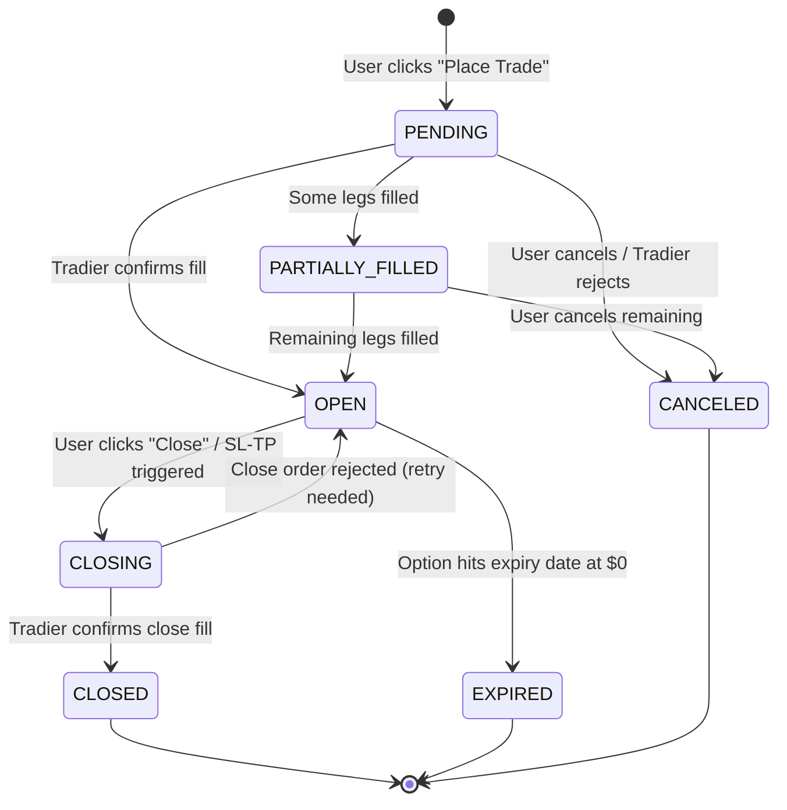

# Point 11: Position Lifecycle Management — Deep Dive (Double Deep)

> **Status:** FINALIZED ✅  
> **Date:** Feb 19, 2026  
> **Depends On:** Point 4 (Brackets), Point 8 (Optimistic Locking), Point 9 (Tradier), Point 10 (Concurrency)

---

## 🎯 The Goal: "No Impossible States"
A trade must follow a strict path from birth to death.
No trade can be in `CLOSED` status while having unfilled orders at Tradier.
No trade can be "stuck" in `CLOSING` forever.

---

## 🔄 The State Machine

### All Valid States

| State | Meaning | Who Sets It |
|-------|---------|-------------|
| `PENDING` | Order sent to Tradier, not yet filled | App (on place_order) |
| `OPEN` | Order filled, position is live | Cron (on fill confirmation) |
| `PARTIALLY_FILLED` | Multi-leg order, some legs filled | Cron (on partial fill) |
| `CLOSING` | Close order sent, not yet executed | App (on close_position) |
| `CLOSED` | Position fully closed, P&L finalized | Cron (on close confirmation) |
| `EXPIRED` | Option expired worthless (OCC) | Cron (on expiration date) |
| `CANCELED` | Order canceled before fill | App/Cron (on cancel) |

### State Diagram



---

## 🚫 Forbidden Transitions (The "Cannot Happen" Rules)

| From | To | Why It's Forbidden |
|------|----|--------------------|
| `PENDING` | `CLOSED` | Can't close what was never opened |
| `PENDING` | `CLOSING` | Can't close what was never opened |
| `PENDING` | `EXPIRED` | Can't expire what was never opened |
| `CLOSED` | ANY | Terminal state. Nothing changes. |
| `EXPIRED` | ANY | Terminal state. Nothing changes. |
| `CANCELED` | ANY | Terminal state. Nothing changes. |
| `CLOSING` | `PENDING` | Can't go backwards |
| `OPEN` | `PENDING` | Can't go backwards |
| `OPEN` | `CANCELED` | An open position exists — must close, not cancel |

---

## 🛡️ Transition Guards

Each transition has **conditions** that must be true before it's allowed.

| Transition | Guard Condition |
|-----------|-----------------|
| `PENDING → OPEN` | Tradier order status = `filled` AND all legs filled |
| `PENDING → PARTIALLY_FILLED` | Tradier order status = `partially_filled` |
| `PENDING → CANCELED` | Tradier order status = `canceled` OR `rejected` |
| `PARTIALLY_FILLED → OPEN` | All remaining legs now filled |
| `PARTIALLY_FILLED → CANCELED` | User explicitly cancels + unfilled legs canceled at Tradier |
| `OPEN → CLOSING` | Close order successfully placed at Tradier (order_id returned) |
| `OPEN → EXPIRED` | `expiry_date <= today` AND `current_price <= $0.05` (worthless) |
| `CLOSING → CLOSED` | Tradier close order status = `filled` |
| `CLOSING → OPEN` | Tradier close order status = `rejected` (need to retry) |

---

## 💻 Implementation

### 1. The State Enum

```python
# backend/models/enums.py
import enum

class TradeStatus(str, enum.Enum):
    PENDING = "PENDING"
    OPEN = "OPEN"
    PARTIALLY_FILLED = "PARTIALLY_FILLED"
    CLOSING = "CLOSING"
    CLOSED = "CLOSED"
    EXPIRED = "EXPIRED"
    CANCELED = "CANCELED"
```

### 2. The Transition Map (Code)

```python
# backend/services/lifecycle.py

# Valid transitions: { current_state: [allowed_next_states] }
VALID_TRANSITIONS = {
    TradeStatus.PENDING: [
        TradeStatus.OPEN,
        TradeStatus.PARTIALLY_FILLED,
        TradeStatus.CANCELED,
    ],
    TradeStatus.PARTIALLY_FILLED: [
        TradeStatus.OPEN,
        TradeStatus.CANCELED,
    ],
    TradeStatus.OPEN: [
        TradeStatus.CLOSING,
        TradeStatus.EXPIRED,
    ],
    TradeStatus.CLOSING: [
        TradeStatus.CLOSED,
        TradeStatus.OPEN,  # Close rejected → revert to OPEN
    ],
    # Terminal states — no transitions allowed
    TradeStatus.CLOSED: [],
    TradeStatus.EXPIRED: [],
    TradeStatus.CANCELED: [],
}
```

### 3. The State Machine Class

```python
# backend/services/lifecycle.py

class LifecycleManager:
    def __init__(self, db_session):
        self.db = db_session
    
    def transition(self, trade: PaperTrade, new_status: TradeStatus, 
                   trigger: str, metadata: dict = None):
        """
        Attempt a state transition. Raises if invalid.
        
        Args:
            trade: The trade to transition
            new_status: Target state
            trigger: What caused this ("user_close", "cron_sync", "sl_triggered")
            metadata: Optional context (e.g., {"tradier_order_id": "12345"})
        """
        old_status = TradeStatus(trade.status)
        
        # 1. Validate the transition
        if new_status not in VALID_TRANSITIONS.get(old_status, []):
            raise InvalidTransitionError(
                f"Cannot transition from {old_status} to {new_status}. "
                f"Allowed: {VALID_TRANSITIONS.get(old_status, [])}"
            )
        
        # 2. Apply the transition
        trade.status = new_status.value
        trade.version += 1  # Optimistic lock (Point 8)
        trade.updated_at = datetime.utcnow()
        
        # 3. Handle terminal state side effects
        if new_status == TradeStatus.CLOSED:
            trade.closed_at = datetime.utcnow()
            trade.realized_pnl = self._calculate_realized_pnl(trade)
        elif new_status == TradeStatus.EXPIRED:
            trade.closed_at = datetime.utcnow()
            trade.realized_pnl = -(trade.entry_price * trade.quantity * 100)
        
        # 4. Log the transition (Audit Trail)
        audit = StateTransition(
            trade_id=trade.id,
            from_status=old_status.value,
            to_status=new_status.value,
            trigger=trigger,
            metadata_json=json.dumps(metadata or {}),
            created_at=datetime.utcnow()
        )
        self.db.add(audit)
        self.db.commit()
        
        return trade
    
    def _calculate_realized_pnl(self, trade):
        """Calculate P&L on close."""
        if trade.direction == 'LONG':
            return (trade.exit_price - trade.entry_price) * trade.quantity * 100
        else:
            return (trade.entry_price - trade.exit_price) * trade.quantity * 100
```

---

## 📝 The Audit Trail

Every state change is recorded. This is critical for debugging and backtesting (Point 6).

### Audit Table Schema

```python
# backend/database/models.py

class StateTransition(Base):
    __tablename__ = 'state_transitions'
    
    id = Column(Integer, primary_key=True)
    trade_id = Column(Integer, ForeignKey('paper_trades.id'), nullable=False)
    from_status = Column(String(25), nullable=False)
    to_status = Column(String(25), nullable=False)
    trigger = Column(String(50), nullable=False)
    # Examples: "user_close", "cron_fill_check", "sl_triggered", "tp_triggered",
    #           "expiry_check", "user_cancel", "tradier_rejected"
    metadata_json = Column(Text, default='{}')
    # Examples: {"tradier_order_id": "12345"}, {"reason": "margin_violation"}
    created_at = Column(DateTime, nullable=False)
    
    trade = relationship("PaperTrade", backref="transitions")
```

### Example Audit Trail for a Complete Trade

| # | From | To | Trigger | Metadata | Time |
|---|------|----|---------|----------|------|
| 1 | — | PENDING | `user_place` | `{"ticker": "NVDA", "order_id": "T-001"}` | 10:01:00 |
| 2 | PENDING | OPEN | `cron_fill_check` | `{"fill_price": 5.20}` | 10:01:45 |
| 3 | OPEN | CLOSING | `sl_triggered` | `{"sl_price": 4.16, "close_order_id": "T-002"}` | 14:30:22 |
| 4 | CLOSING | CLOSED | `cron_fill_check` | `{"fill_price": 4.10, "pnl": -110.00}` | 14:30:58 |

---

## ⏰ Cron Job Integration: Automatic Transitions

### The `lifecycle_sync` Cron (runs every 60s)

```python
# backend/services/monitor_service.py

def lifecycle_sync(self):
    """
    Cron: Check all non-terminal trades and update their states.
    Uses Advisory Lock (Point 10) to prevent overlap.
    """
    acquired = self._acquire_lock(LOCK_ID_LIFECYCLE_SYNC)
    if not acquired:
        return
    
    try:
        # --- PENDING trades: check if filled ---
        pending = self.db.query(PaperTrade).filter_by(
            status=TradeStatus.PENDING.value
        ).all()
        
        for trade in pending:
            broker = BrokerFactory.get_broker(trade.user)
            order = broker.get_order(trade.tradier_order_id)
            
            if order['status'] == 'filled':
                trade.entry_price = float(order['avg_fill_price'])
                self.lifecycle.transition(
                    trade, TradeStatus.OPEN, 
                    trigger='cron_fill_check',
                    metadata={'fill_price': trade.entry_price}
                )
            elif order['status'] == 'partially_filled':
                self.lifecycle.transition(
                    trade, TradeStatus.PARTIALLY_FILLED,
                    trigger='cron_fill_check',
                    metadata={'filled_qty': order['filled_quantity']}
                )
            elif order['status'] in ('canceled', 'rejected'):
                self.lifecycle.transition(
                    trade, TradeStatus.CANCELED,
                    trigger='cron_fill_check',
                    metadata={'reason': order.get('reason', 'unknown')}
                )
        
        # --- CLOSING trades: check if close order filled ---
        closing = self.db.query(PaperTrade).filter_by(
            status=TradeStatus.CLOSING.value
        ).all()
        
        for trade in closing:
            broker = BrokerFactory.get_broker(trade.user)
            order = broker.get_order(trade.close_order_id)
            
            if order['status'] == 'filled':
                trade.exit_price = float(order['avg_fill_price'])
                self.lifecycle.transition(
                    trade, TradeStatus.CLOSED,
                    trigger='cron_fill_check',
                    metadata={'fill_price': trade.exit_price}
                )
            elif order['status'] == 'rejected':
                self.lifecycle.transition(
                    trade, TradeStatus.OPEN,
                    trigger='cron_close_rejected',
                    metadata={'reason': order.get('reason', 'unknown')}
                )
        
        # --- OPEN trades: check for expiration ---
        open_trades = self.db.query(PaperTrade).filter(
            PaperTrade.status == TradeStatus.OPEN.value,
            PaperTrade.expiry_date <= date.today()
        ).all()
        
        for trade in open_trades:
            broker = BrokerFactory.get_broker(trade.user)
            quote = broker.get_quotes([trade.option_symbol])
            
            if float(quote['last']) <= 0.05:
                self.lifecycle.transition(
                    trade, TradeStatus.EXPIRED,
                    trigger='cron_expiry_check',
                    metadata={'last_price': quote['last']}
                )
    finally:
        self._release_lock(LOCK_ID_LIFECYCLE_SYNC)
```

---

## 🧊 Edge Cases

### 1. The "Stuck in CLOSING" Problem
**Scenario:** Close order placed, but Tradier never fills it (illiquid option).
**Fix:** Add a `closing_timeout` (e.g., 30 minutes). If still CLOSING after timeout:
```python
# In lifecycle_sync cron
if trade.status == 'CLOSING':
    time_in_closing = datetime.utcnow() - trade.updated_at
    if time_in_closing > timedelta(minutes=30):
        # Alert the user — manual intervention needed
        send_notification(trade.user, 
            f"⚠️ Close order for {trade.ticker} hasn't filled in 30 min. "
            f"Check Tradier or cancel and retry."
        )
```

### 2. The "After-Hours Fill" Problem
**Scenario:** User places order at 3:59 PM. Fills at 4:01 PM (after-hours).
**Fix:** We accept the fill regardless. The state machine doesn't care about market hours — only the cron job scheduling does (Point 5). If Tradier fills it, we record it.

### 3. The "Partial Fill Cancel" Problem
**Scenario:** 5 contracts ordered, 3 filled, user cancels remaining 2.
**Fix:** Transition to OPEN with `quantity` updated to 3.
```python
if order['status'] == 'partially_filled' and user_requested_cancel:
    trade.quantity = order['filled_quantity']
    self.lifecycle.transition(trade, TradeStatus.OPEN, trigger='user_partial_cancel')
```

### 4. The "Assignment" Problem
**Scenario:** Short option gets assigned by OCC before expiry.
**Fix:** Treat as equivalent to `CLOSED` with the assignment price as exit price.
```python
if order['status'] == 'assigned':
    trade.exit_price = order['assignment_price']
    self.lifecycle.transition(
        trade, TradeStatus.CLOSED,
        trigger='occ_assignment',
        metadata={'assignment_date': order['assignment_date']}
    )
```

---

## 🎨 UI State Mapping

Each state renders differently in the Portfolio tab (Point 3).

| State | Color | Icon | Badge Text | Tab |
|-------|-------|------|------------|-----|
| `PENDING` | 🟡 Yellow | Spinner | "Pending Fill" | Open |
| `OPEN` | 🟢 Green | Active dot | "Live" | Open |
| `PARTIALLY_FILLED` | 🟠 Orange | Half-fill icon | "Partial" | Open |
| `CLOSING` | 🔵 Blue | Spinner | "Closing..." | Open |
| `CLOSED` | ⚪ Gray | Checkmark | "Closed" | History |
| `EXPIRED` | 🔴 Red | X icon | "Expired" | History |
| `CANCELED` | ⚪ Gray | Slash icon | "Canceled" | History |

---

## 🔔 Notifications on State Change

Each transition triggers a user notification (toast + optional sound from Point 4).

| Transition | Notification | Sound |
|-----------|-------------|-------|
| PENDING → OPEN | "✅ {ticker} order filled at ${price}" | `success` |
| PENDING → CANCELED | "❌ {ticker} order was rejected" | `error` |
| OPEN → CLOSING | "🔄 Closing {ticker}..." | `click` |
| CLOSING → CLOSED | "✅ {ticker} closed. P&L: ${pnl}" | `success` or `error` |
| CLOSING → OPEN | "⚠️ Close rejected for {ticker}. Retry needed." | `warning` |
| OPEN → EXPIRED | "💀 {ticker} expired worthless" | `error` |

---

## ✅ Design Decisions (User Confirmed)

| Question | Decision |
|----------|----------|
| Auto-cancel stale PENDING? | **No.** Just poll until filled. No timeout on PENDING. |
| "Close All" batch button? | **No.** Individual close only. |
| Weekend PENDING orders? | **Fine.** They stay PENDING until market opens Monday. |
| Notification on every transition? | **Yes.** Toast + sound per transition. |

---

## 📋 Summary

| Component | Decision |
|-----------|----------|
| **States** | 7 states: PENDING, OPEN, PARTIALLY_FILLED, CLOSING, CLOSED, EXPIRED, CANCELED |
| **Transitions** | Strict whitelist (anything not listed = `InvalidTransitionError`) |
| **Guards** | Conditions checked before each transition |
| **Audit Trail** | `state_transitions` table logs every change |
| **Automation** | `lifecycle_sync` cron handles PENDING→OPEN, CLOSING→CLOSED, OPEN→EXPIRED |
| **Timeout** | CLOSING trades alert user after 30 min (PENDING has no timeout) |
| **Terminal States** | CLOSED, EXPIRED, CANCELED — no further transitions allowed |
| **UI Mapping** | Each state has a distinct color, icon, and tab placement |
| **Notifications** | Toast + sound on every state transition |

---

## 🗂️ Files Affected

```
backend/
├── models/
│   └── enums.py              # TradeStatus enum
├── database/
│   └── models.py             # StateTransition table
├── services/
│   ├── lifecycle.py          # LifecycleManager + VALID_TRANSITIONS
│   └── monitor_service.py    # lifecycle_sync cron job
frontend/
└── js/
    └── components/
        └── portfolio.js      # State-based rendering + notifications
```
